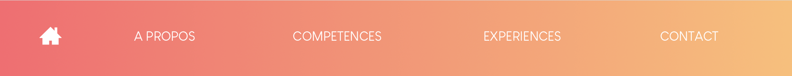
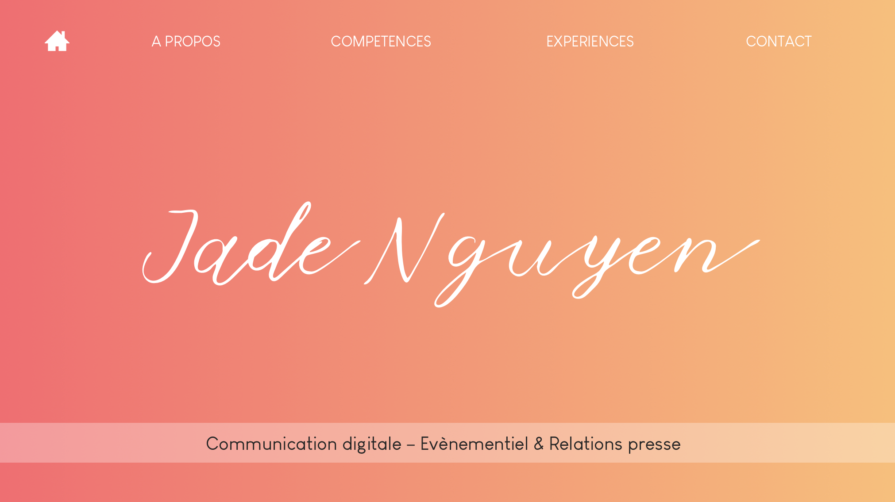
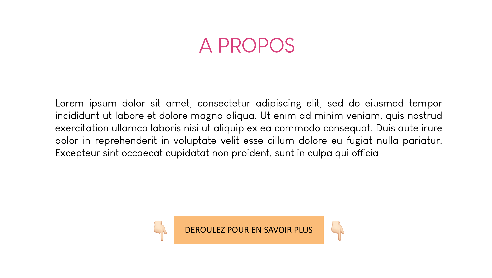
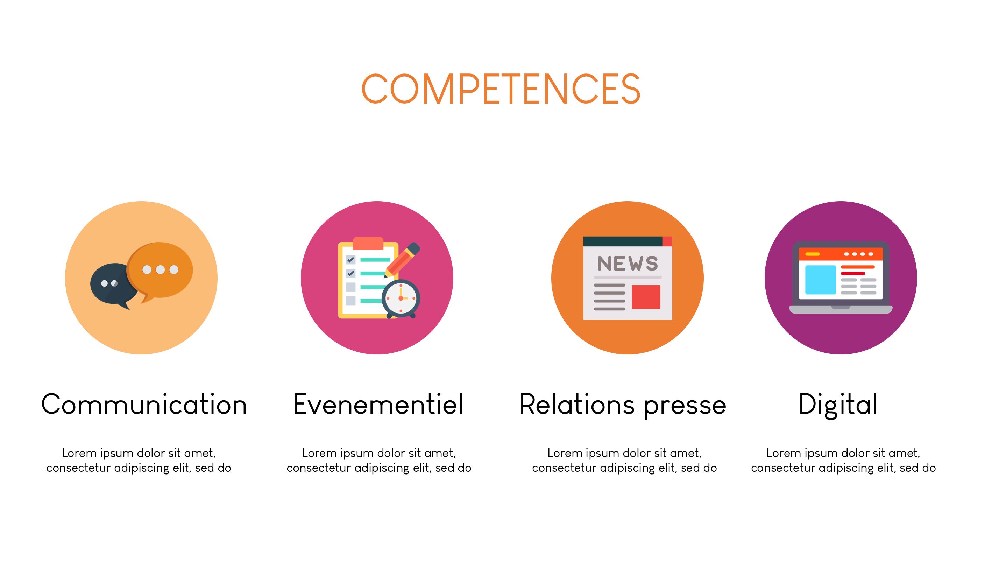
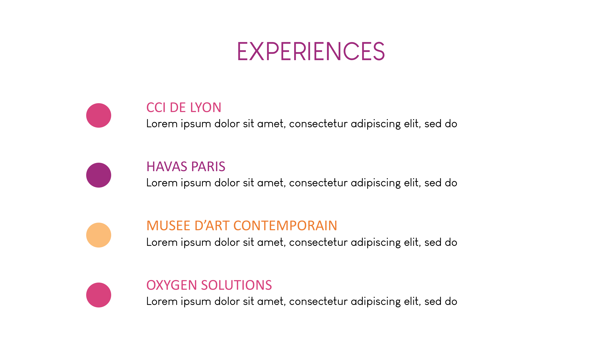
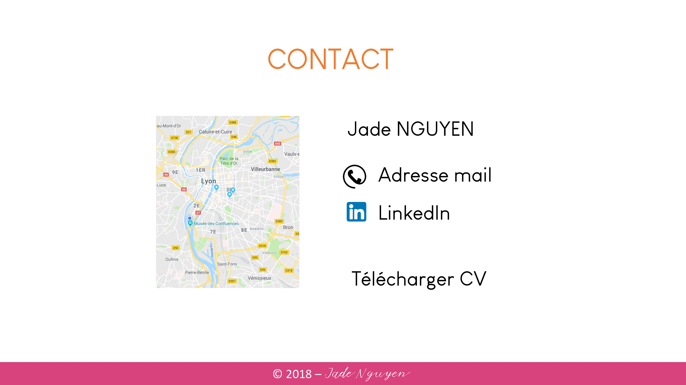

# PROJET
Ce site est un portefolio me permettant d'exposer mes compétences et mes différentes expériences professionnelles afin de m'aider à trouver une alternance pour la renrée.

# CIBLE
Mon portfolio s'adresse aux recruteurs en communication, événementiel et relations presse de la région lyonnaise car il s'agit des domaines d'activité dans lesquels je  souhaiterais trouver une alternance.

# HEADER

Le header de mon site contient une barre de navigation en haut du site composée de plusieurs boutons renvoyant aux différentes pages du site.

 
# PAGE D'ACCUEIL - Jade NGUYEN

Il s'agit de la page d'accueil du site.
Le titre de la page "Jade Nguyen" est une animation JavaScript, la typographie apparaît progressivement puis disparaît.
En bas de la page se situe un bandeau avec les inscriptions "Communication digitale - Evenementiel & Relations presse".

# PAGE 2 - A propos

La seconde page du site contient le titre de la page, un paragraphe de présentation dans laquelle je décris qui je suis ainsi que mes objectifs professionnels et un bouton en bas de page renvoyant à la page suivante.

# PAGE 3- Compétences

Sur cette page, j'expose mes différentes compétences professionnelles.
Celles-ci sont représentées par des icônes rondes avec des pictogrammes représentant ces compétences. Sous chacune d'entre elle, il y aura des exemples de missions liées à ces compétences :

## Communication
Exemples de compétences en communication
## Evenementiel
Exemples de compétences en événementiel
## Relations presse
Exemples de compétences en relation presse
## Digital
Exemples de compétences en digital

## PAGE 4 - Experiences 

Sur cette page, j'expose mes différentes expériences professionnelles (stages et alternance) sous forme de liste.

## PAGE 5 - Contact

Cette page contient mes coordonnées : nom, adresse mail, linkedin.
Il a également un lien permettant de télécgarger mon CV.

## FOOTER

Le footer contient mon nom et l'année de création du site.